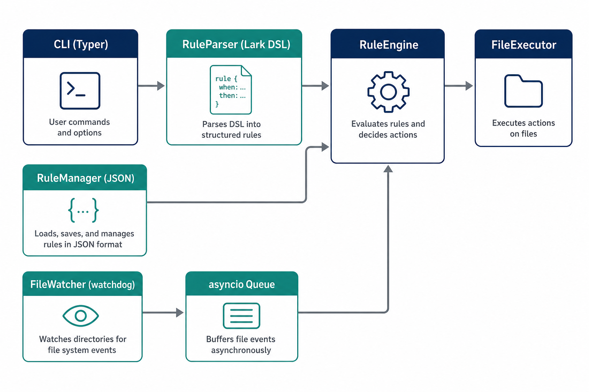
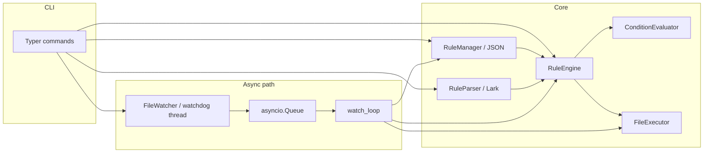

# Smart File Organizer

A small **Python CLI** that organizes files using a **custom rule DSL** (parsed with [Lark](https://github.com/lark-parser/lark)), optional **async** directory watching via [watchdog](https://github.com/gorakhargosh/watchdog) + `asyncio`, and **JSON** rule persistence. Rules can move files into folders or rename them with date/name patterns.




---

## Quick start (minimal steps, `uv`)

```bash
git clone <your-repo-url>
cd MPCS-51052-Project
uv sync
uv run organizer --help
```

Add a rule and run a one-off cleanup:

```bash
uv run organizer rules add --rule 'IF extension == pdf THEN move to ~/Documents/PDFs'
uv run organizer run --path ~/Downloads
```

Watch mode (applies rules when new files appear):

```bash
uv run organizer watch --path ~/Downloads
```

Developer checks (lint, types, tests):

```bash
uv sync --group dev
uv run ruff check organizer tests
uv run ruff format organizer tests --check
uv run mypy organizer
uv run pytest
```

---

## Architecture

### Conceptual diagram (Mermaid)



### Runtime flow

1. **`organizer run`**: load rules from disk → for each file in the target directory (non-recursive) build a `FileEvent` → first matching rule by `priority` wins → `FileExecutor` performs move/rename (with collision suffixes).
2. **`organizer watch`**: watchdog posts paths into an `asyncio` queue; `watch_loop` reloads rules and applies the same engine path for each file event.

---

## Code map (where to read)

| Module | Role |
|--------|------|
| `organizer/cli.py` | Typer entrypoints: `run`, `watch`, `rules` subcommands. |
| `organizer/dsl_parser.py` | Lark grammar + `RuleParser.parse` → `Rule`. |
| `organizer/condition_evaluator.py` | Pure evaluation of `Condition` on `FileEvent`. |
| `organizer/rule_engine.py` | Ordering + `match` / `apply_first` (supports `--dry-run`). |
| `organizer/file_executor.py` | Safe `move` / pattern `rename`. |
| `organizer/rule_manager.py` | `~/.organizer/rules.json` load/save. |
| `organizer/file_watcher.py` | Thread-safe enqueue into `asyncio.Queue`. |
| `organizer/scheduler.py` | `watch_loop` async consumer. |
| `organizer/models.py` | `FileEvent`, `Condition`, `Rule`, `ActionKind`. |

---

## Rule DSL (examples)

```text
IF extension == pdf THEN move to ~/Documents/PDFs
IF extension IN ["jpg", "png"] THEN move to ~/Pictures
IF name CONTAINS invoice THEN move to ~/Finance
IF size > 10MB THEN move to ~/LargeFiles
IF extension == jpg AND name CONTAINS vacation THEN move to ~/Pictures
IF extension == jpg THEN rename to "{date}_{stem}.{ext}"
```

Quoted strings and bare identifiers (e.g. `pdf`) are supported for extension atoms to reduce shell-quoting pain on Windows.

Rename placeholders include `{stem}`, `{ext}`, `{name}`, `{date}`, and `{date:...}` (strftime format inside braces).

---

## Project layout

```text
organizer/          # installable package (application code)
tests/              # pytest suite
docs/               # diagrams for documentation
pyproject.toml      # metadata, scripts, ruff/mypy/pytest, uv dev group
```

---

## License

Course / personal project — specify your license here if you publish publicly.
